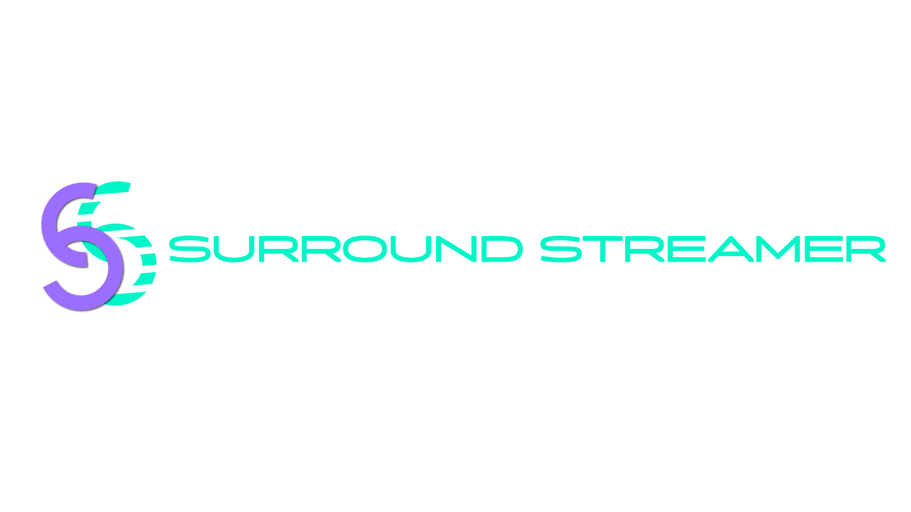
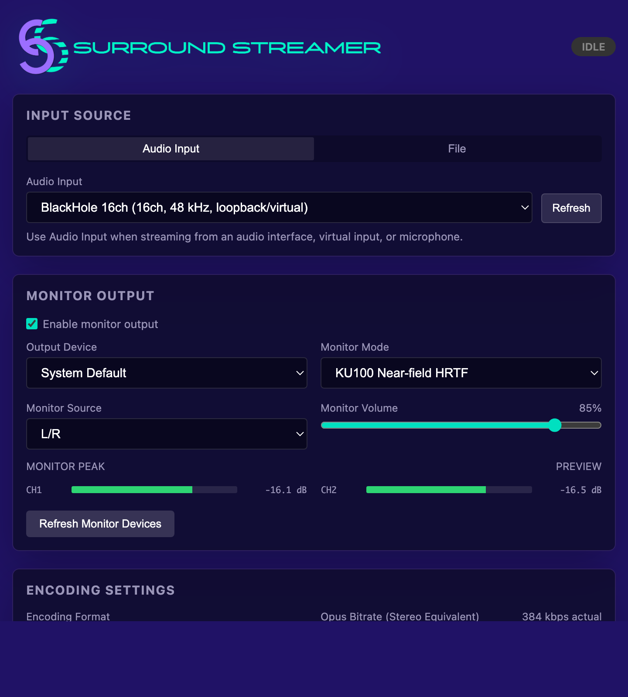
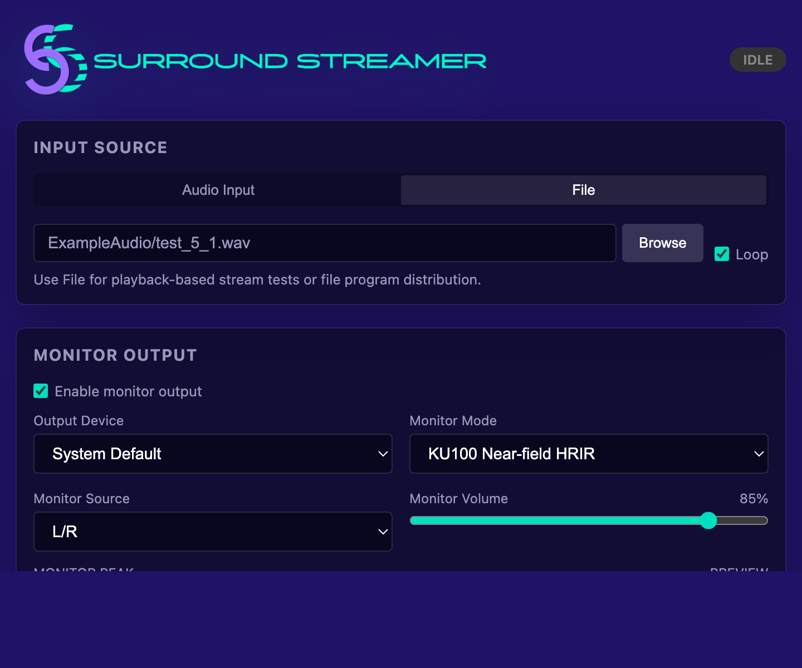
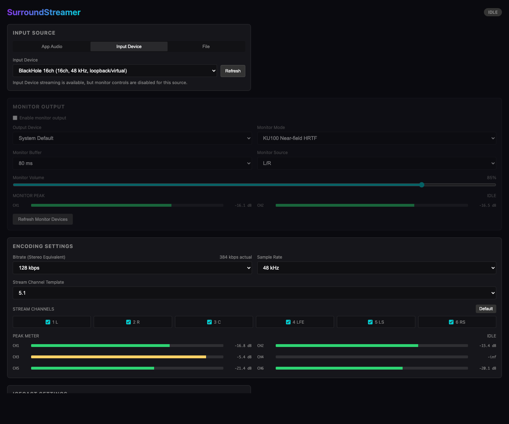
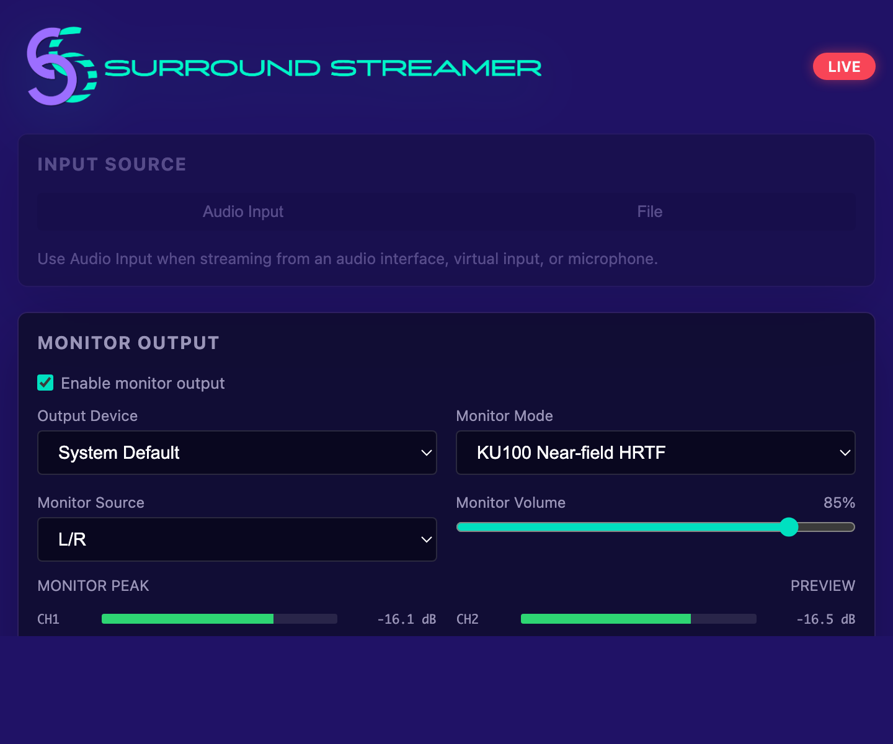

  

# SurroundStreamer

SurroundStreamer is a desktop streaming tool for musicians, engineers, and spatial-audio creators who want to deliver live music and multichannel audio in surround.
It sends audio from an audio interface or audio file to an Icecast/Shoutcast-compatible streaming server as Ogg Opus surround audio, stereo MP3, or both.
Monitor output, channel templates up to 7.1, and KU100 near-field HRIR preview help you check the stream before and during playback.
The current release supports macOS Apple Silicon and Windows x64. Linux support is in preparation.

<h2 align="center">DOWNLOAD</h2>

| Platform            | Download                                                                                             |
| ------------------- | ---------------------------------------------------------------------------------------------------- |
| macOS Apple Silicon | [SurroundStreamer-0.1.1.dmg](https://github.com/t-noami/SurroundStreamer/releases/tag/v0.1.1)        |
| Windows x64         | [surround-streamer-0.1.1-setup.exe](https://github.com/t-noami/SurroundStreamer/releases/tag/v0.1.1) |
| Linux               | Not available yet                                                                                    |

## System Requirements

> [!IMPORTANT]
> SurroundStreamer now focuses on Audio Input and File sources.
> App Audio capture has been removed from the current release line.

- macOS: macOS 14.2 or later on Apple Silicon
- Windows: Windows x64
- Audio Input capture: Core Audio on macOS; ASIO, MMDevice/WASAPI, and DirectShow fallback on Windows
- File source: FFmpeg file playback path
- Linux: not available yet

## Developer

- Studio: Non-REM Studio
- Contact: info@non-rem.com
- GitHub: [t-noami](https://github.com/t-noami)
- Repository: https://github.com/t-noami/SurroundStreamer

## Current Scope

- Primary streaming format: Ogg Opus over Icecast
- Standard channel templates: Mono, Stereo, Stereo + C, 5.1, 7.1
- Default encoding: 48 kHz, 128 kbps stereo-equivalent bitrate
- Main source order: Audio Input, File
- Audio Input capture: macOS uses the Core Audio helper PCM path; Windows uses native ASIO and MMDevice/WASAPI capture with DirectShow fallback.
- File source: file playback and preview monitor support
- Monitor Output: Stereo Pair, Stereo Downmix, KU100 Near-field HRIR

## Important Notes

- App Audio capture has been removed from the current release line. Use Audio Input capture with a physical, virtual, or loopback device when application audio needs to be routed into SurroundStreamer.
- Audio Input Monitor Output uses the shared WebAudio direct monitor path when browser audio-device access is available. Windows also has a backend-owned FFmpeg/WASAPI monitor path for ASIO Audio Input and File-source monitoring.
- Opus output is constrained to supported sample rates. 44.1 kHz and 96 kHz sources are converted to 48 kHz for stream output.
- 7.1.2 and 7.1.4 are not part of the standard build. The current production target is up to 7.1 because that maps cleanly to common Opus channel mapping support.
- KU100 near-field HRIR data is included under CC BY 4.0. Attribution is listed below.
- For Windows surround input, use an ASIO-capable audio interface or ASIO virtual audio device with 6 or more input/output channels.
- Linux support is in preparation.

## User Manual

SurroundStreamer sends audio from audio inputs or audio files as Ogg Opus, stereo MP3, or both.

### Basic Screen

The main screen is organized into these areas:

- `Input Source`: Selects the streaming source.
- `Monitor Output`: Configures monitor playback before or during streaming.
- `Encoding Settings`: Configures bitrate, sample rate, and channel templates.
- `Stream Server Settings`: Configures Opus Icecast and Stereo MP3 destinations.
- `START STREAM` / `STOP STREAM`: Starts or stops the stream.
- Logs: open from the Window menu on macOS, or `Window > Show Logs` on Windows/Linux.
- GitHub Repository: open from the Help menu on macOS, or `Help > GitHub Repository` on Windows/Linux.

### First-Run Settings

The first-run Opus Icecast defaults are:

- Host: empty
- Port: `8000`
- Mount Point: `/stream`
- Password: empty

Icecast settings are saved after editing and restored on the next launch. If settings are already saved, the saved values are used instead of the first-run defaults.

Stereo MP3 settings are saved with the same settings set. MP3 defaults are Icecast mode, port `8000`, mount point `/stream.mp3`, and `128k` bitrate.

### Input Sources

#### File

Use File when streaming audio from a selected audio file.

1. Select `File` in `Input Source`.
2. Select an audio file with `Browse`.
3. Enable `Loop` if repeated playback is needed.
4. Select a `Stream Channel Template` that matches the file channel layout.

For File source, Monitor Output is useful only after a playable file has been selected.

#### Audio Input

Use Audio Input when streaming from an audio interface, virtual input, or microphone input.

1. Select `Audio Input` in `Input Source`.
2. Select the audio input in `Audio Input`.
3. Use `Refresh` if the device list needs to be updated.

Monitor Output is available for Audio Input source through the shared WebAudio direct monitor path when browser audio-device access is available. Windows also supports ASIO Audio Input monitoring through the backend-owned FFmpeg/WASAPI renderer path; File-source monitoring on Windows uses the same backend renderer to avoid browser-device routing issues.

For surround Audio Input streaming, the input device must expose enough real input channels for the selected stream layout. On macOS, use a Core Audio audio interface or virtual audio device with 6 or more channels for 5.1 or larger layouts. On Windows, use an ASIO-capable audio interface or ASIO virtual audio device with 6 or more input/output channels.

On macOS, audio-input streaming requires microphone permission. If streaming does not capture input audio, confirm that macOS Privacy settings allow microphone access for SurroundStreamer.

### Encoding Settings

`Encoding Settings` controls the stream format.

- `Encoding Format`: Selects `Ogg Opus / Icecast (surround)`, `Ogg Opus + stereo MP3`, or `Stereo MP3 only`.
- `Opus Bitrate (Stereo Equivalent)`: Opus bitrate expressed as a stereo-equivalent value. The actual bitrate increases with the selected channel count. This is hidden when `Stereo MP3 only` is selected.
- `Sample Rate`: Opus stream sample rate. The default is 48 kHz.
- `Stream Channel Template`: Selects the stream channel layout.
- `Stream Channels`: Selects the channels included in the stream.
- `MP3 Audio Source`: Selects whether the MP3 output uses the L/R stereo pair, a stereo downmix, or KU100 Near-field HRIR processing.

Standard templates are `Mono`, `Stereo`, `Stereo + C`, `5.1`, and `7.1`. For multichannel sources, `5.1` is the default practical starting point.

MP3 stereo processing uses the same spatial gain policy as Monitor Output:

- `Stereo Pair (L/R)`: sends the selected stream's first two channels directly to MP3 left/right. Mono is duplicated to left/right.
- `Stereo Downmix`: applies L/R at `1.0`, center at `0.707` to both sides, LFE muted, side/rear channels at `0.707` to their matching side, then applies a `0.707` master gain.
- `KU100 Near-field HRIR`: applies L/R at `1.0`, center and side/rear channels at `0.707`, LFE muted, then applies KU100 HRIR convolution with a `0.35` master gain.

The current Stereo Downmix coefficients are shared between Monitor Output and MP3 output for consistency. A more conservative live-music/DJ downmix profile, such as lowering side/rear contribution, may be considered later, but it is not part of the current release.

### Monitor Output

Monitor Output is used to check audio before or during streaming.

- `Enable monitor output`: Enables monitor playback.
- `Output Device`: Selects the monitor output device.
- `Monitor Mode`: Selects the monitor processing mode.
- `Monitor Source`: Selects the channel pair used in Stereo Pair mode.
- `Monitor Volume`: Controls only the monitor output level.

Monitor modes:

- `Stereo Pair`: Monitors the selected two-channel pair directly.
- `Stereo Downmix`: Downmixes multichannel audio to stereo.
- `KU100 Near-field HRIR`: Renders a binaural monitor signal using KU100 near-field HRIR data.

Monitor Volume is applied after the selected monitor mode processing. It does not affect the streamed audio.

### Stream Server Settings

`Stream Server Settings` configures the active streaming destination fields for the selected encoding format. `Ogg Opus + stereo MP3` shows separate `Opus Icecast` and `Stereo MP3` groups.

- `Host`: Icecast server host name or IP address
- `Port`: Icecast port
- `Mount Point`: Stream mount point, for example `/stream`
- `Password`: Source password
- `MP3 Shoutcast 1`: Uses the legacy Shoutcast source handshake directly, so no mount point is configured for that output.

Mount Point should start with `/`, such as `/stream`. If the leading `/` is missing, the app normalizes it when saving.

### Starting And Stopping

Click `START STREAM` to start streaming.

If required settings are blank, the app highlights the invalid fields and does not show the loading overlay. Highlighted fields include input source, stream channel selection, Opus Host/Port/Password, and MP3 Host/Port/Password.

During stream startup, a `Starting stream...` / `Connecting to the streaming server` overlay is shown and the START button is temporarily disabled. If the backend reports a connection failure, a `Connection failed` dialog appears with the error message.

While streaming, the following controls are locked to prevent accidental changes:

- `Input Source`
- `Encoding Settings`
- `Stream Server Settings`

Click `STOP STREAM` to stop streaming. Closing the window with the macOS close button also quits the app and stops any FFmpeg or helper processes running in the background.

### Stream Playback Check

Use the following web player to confirm that audio is reaching the streaming destination:

https://non-rem.com/SurroundWebPlayer/

Enter the Icecast Streaming URL and start playback. If the player remains buffering, check `Logs` in SurroundStreamer and confirm the mount state on the Icecast server. This web player is an external verification page and is not bundled with the app.

### Troubleshooting

If Icecast connection fails:

- Confirm Host, Port, Mount Point, and Password.
- If `403 Forbidden` appears, check the password, source user, mount point, and Icecast server permissions.
- Passwords containing `@` are URL-encoded by the app.
- If startup fails after connecting, check the `Connection failed` dialog and the log messages.

If the player remains buffering:

- Confirm that the Icecast server created the expected mount point.
- Check `Logs` to see whether FFmpeg exits immediately after startup.
- For Audio Input source, confirm that macOS microphone permission is enabled.

If Audio Input source has no audio:

- Confirm that the selected audio input is receiving signal.
- If using a loopback or virtual device, confirm that the routing is not unintentionally mixing system output into the input.
- Confirm macOS microphone permission.

If Monitor Output is unavailable:

- Confirm the selected input source is supported by the current audio backend.
- Confirm the selected Monitor Output device is available, then toggle `Enable monitor output` off and on.
- If the output device list changes, use `Refresh Monitor Devices`.

## Development

Build instructions are split by operating system:

- [Build on macOS](docs/build-macos.md)
- [Build on Windows](docs/build-windows.md)
- [Build on Linux](docs/build-linux.md)
- [Windows Backend Development Guide](docs/windows-backend-development.md)
- [Windows / Linux Portability Assessment](docs/windows-linux-portability-assessment.md)

macOS and Windows are the current release targets. Linux packaging notes remain preparatory.

## Test Stream Config

`test_streamconfig.txt` is a local convenience note for stream testing. Treat it as sensitive operational data and do not publish it.

## License

SurroundStreamer is released under the MIT License. See [LICENSE](LICENSE).

The MIT License is a permissive open-source license that allows commercial use, private use, modification, distribution, and sublicensing, while requiring preservation of copyright and license notices.

The MIT License applies to the software code. It does not grant rights to use the SurroundStreamer name, Non-REM Studio name, logos, icons, application artwork, or other brand assets as official branding for modified or redistributed builds. See [TRADEMARKS.md](TRADEMARKS.md).

Third-party materials remain under their own licenses. This includes the packaged FFmpeg binary and its enabled external libraries, including libopus and libmp3lame, plus the bundled KU100 near-field HRIR extraction.

See [THIRD_PARTY_NOTICES.md](THIRD_PARTY_NOTICES.md) for runtime dependency and bundled resource notices.

## Repository Documents

- `docs/implementation_plan.md`: project history, architecture notes, current plan, and future work
- `docs/releases/`: release notes used for GitHub Releases
- `docs/task.md`: current task status and release checklist

## Third-Party Notices

Third-party license notices are kept outside this README so the distributed resources stay paired
with their own notices:

- [THIRD_PARTY_NOTICES.md](THIRD_PARTY_NOTICES.md): application-wide third-party dependency and bundled resource summary
- [TRADEMARKS.md](TRADEMARKS.md): project name, logo, and brand asset guidelines
- [resources/ffmpeg/THIRD_PARTY_NOTICES.md](resources/ffmpeg/THIRD_PARTY_NOTICES.md): packaged FFmpeg binary details, enabled external libraries, source references, and build configurations
- [resources/ffmpeg/licenses/](resources/ffmpeg/licenses/): FFmpeg, libopus, and LAME license texts
- [resources/ku100-hrir/NOTICE.md](resources/ku100-hrir/NOTICE.md): KU100 near-field HRIR attribution, license, source, DOI, and change statement

## Verification Checklist

Before treating a build as usable:

- App launches successfully
- File source stream starts and stops cleanly
- Audio Input stream starts and stops cleanly
- Icecast connection succeeds with the intended mount point
- Peak meters respond quickly
- Monitor Output works for File and Audio Input sources
- Quitting the app stops FFmpeg and helper processes
- `codesign --verify --deep --strict` passes for the app bundle
